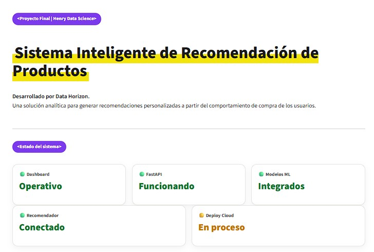
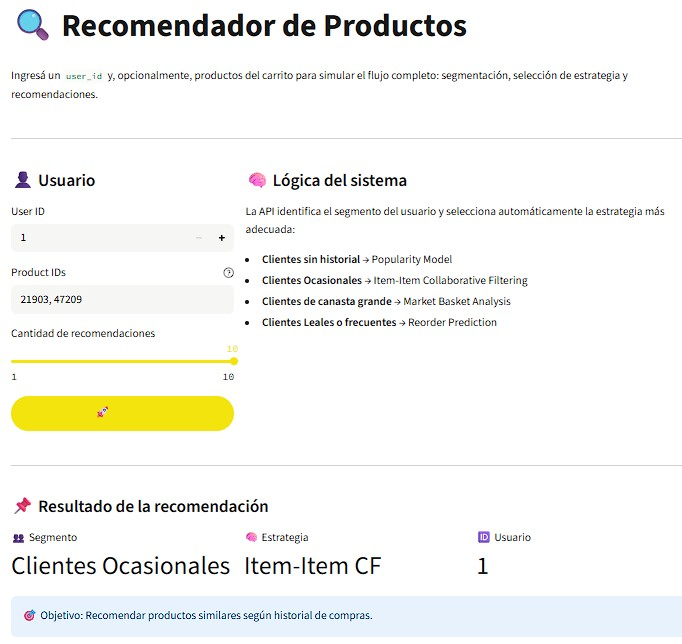
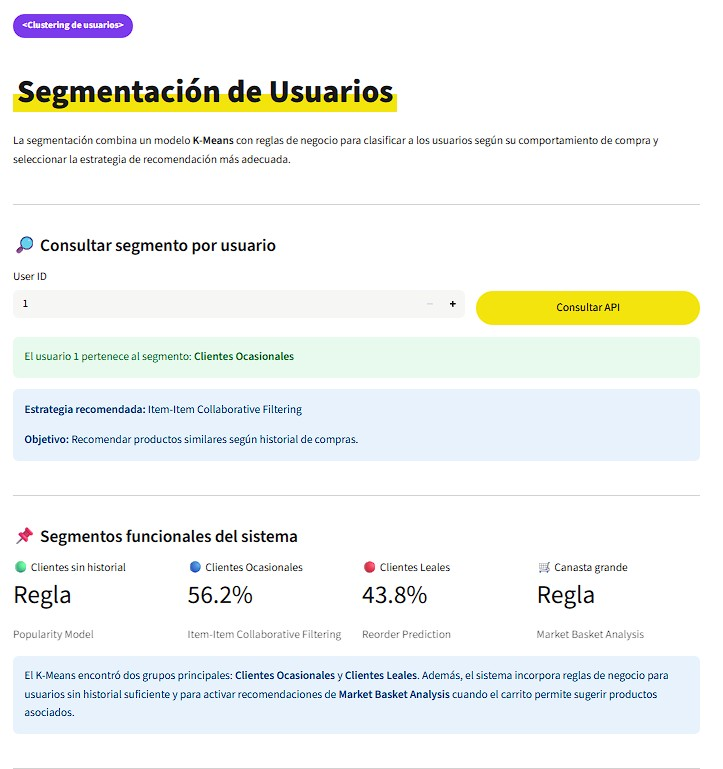
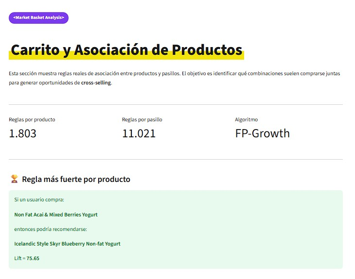
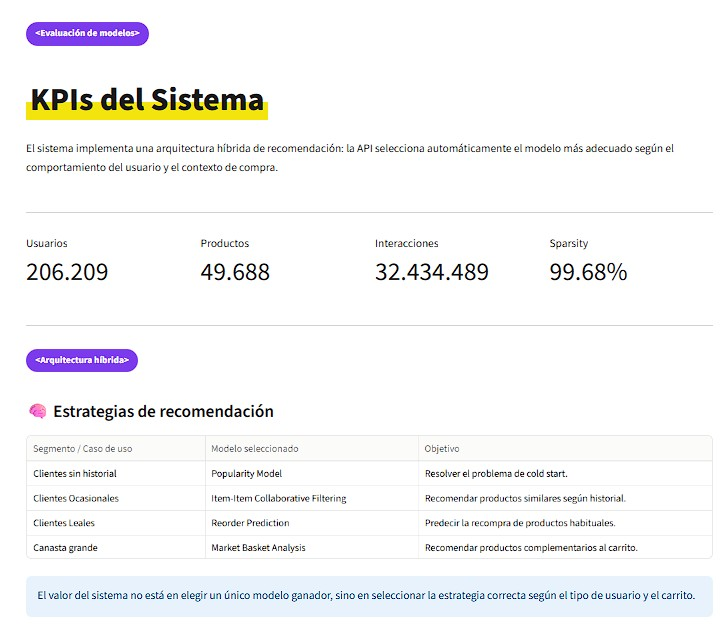
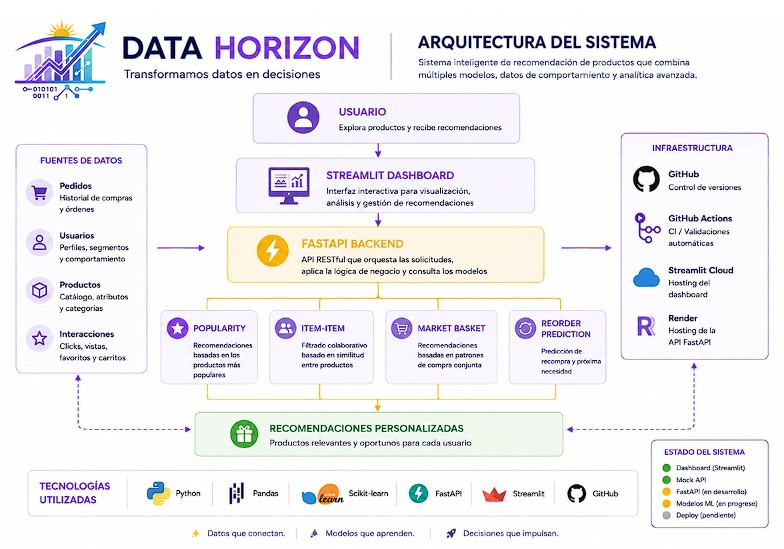

# 🛒 Sistema Inteligente de Recomendación de Productos


Proyecto Final de la carrera **Data Science** de **Henry**.

Desarrollado por **Data Horizon**.

---

# 📌 Descripción

Este proyecto implementa un **Sistema Inteligente de Recomendación de Productos** utilizando el dataset público **Instacart Market Basket Analysis**.

A diferencia de un recomendador tradicional basado en un único algoritmo, la solución implementa una **arquitectura híbrida**, donde múltiples modelos de Machine Learning trabajan de manera coordinada.

El sistema analiza el comportamiento del usuario, determina automáticamente su segmento y selecciona la estrategia de recomendación más adecuada para cada caso.

Entre las técnicas implementadas se incluyen:

- Segmentación de usuarios mediante K-Means.
- Recomendación por Popularidad (Cold Start).
- Filtrado Colaborativo Item-Item.
- Market Basket Analysis mediante FP-Growth.
- Predicción de recompra utilizando XGBoost.

Todo el sistema se encuentra desplegado en la nube mediante **Render**, utilizando **Docker**, **FastAPI** y **Streamlit**.

---

# 🌐 Demo

### Aplicación

https://proyectofinal-datascience-henry.onrender.com

### Repositorio

https://github.com/Caromponce/ProyectoFinal-DataScience-Henry

---

# 🏗 Arquitectura

```

Usuario

↓

Streamlit

↓

FastAPI

↓

Segmentación (KMeans)

↓

Selección automática del modelo

↓

Popularity
Item-Item CF
Market Basket Analysis
Reorder Prediction

↓

Respuesta

```

---

# ⚙ Stack Tecnológico

## Lenguajes

- Python
- Pandas
- NumPy

## Machine Learning

- Scikit-Learn
- XGBoost
- LightGBM
- CatBoost
- mlxtend

## Backend

- FastAPI
- Uvicorn

## Frontend

- Streamlit

## DevOps

- Docker
- Render
- GitHub
- Google Drive

---

# 📂 Estructura del proyecto

```

ProyectoFinal-DataScience-Henry/

├── api/
├── app/
├── assets/
├── docs/
├── notebooks/
├── src/
├── Dockerfile
├── download_models.py
├── start.sh
├── requirements.txt
└── README.md

```

---

# 📊 Dataset

El proyecto utiliza el dataset público **Instacart Market Basket Analysis**, que contiene el historial anonimizado de compras realizadas por más de **206.000 usuarios**.

Está compuesto por más de **32 millones de interacciones** distribuidas en seis tablas relacionadas.

| Tabla | Filas |
|--------|-------:|
| orders.csv | 3.421.083 |
| products.csv | 49.688 |
| aisles.csv | 134 |
| departments.csv | 21 |
| order_products__prior.csv | 32.434.489 |
| order_products__train.csv | 1.384.617 |

Durante el análisis exploratorio se identificó una matriz Usuario–Producto altamente dispersa (99.68% de sparsity), una tasa de recompra cercana al 59% y una distribución de productos con comportamiento Long Tail.

---

# 🤖 Modelos Implementados

## Popularity Baseline

**Objetivo**

Resolver el problema de Cold Start para usuarios sin historial.

**Entrada**

Usuario nuevo.

**Salida**

Productos más populares.

---

## Segmentación de Usuarios (K-Means)

El modelo agrupa automáticamente los usuarios según su comportamiento de compra.

Segmentos obtenidos:

- Clientes sin historial
- Clientes Ocasionales
- Clientes Leales
- Clientes de Canasta Grande

Este modelo **no genera recomendaciones**, sino que determina qué estrategia utilizar posteriormente.

---

## Item-Item Collaborative Filtering

Recomienda productos similares según el historial de compras del usuario mediante similitud coseno.

Se utiliza para usuarios con historial reducido.

---

## Market Basket Analysis

Implementado mediante FP-Growth.

Incluye dos modelos independientes:

- Recomendación de productos complementarios.
- Recomendación de pasillos relacionados.

---

## Reorder Prediction

Modelo supervisado encargado de predecir qué productos volverá a comprar un usuario frecuente.

Durante la etapa experimental se evaluaron:

- Random Forest
- LightGBM
- CatBoost
- XGBoost

Finalmente se seleccionó **XGBoost** por obtener el mejor desempeño.

---

# 🔄 Flujo de Recomendación

```

Usuario

↓

Consulta API

↓

Segmentación

↓

Selección de estrategia

↓

Carga del modelo correspondiente

↓

Generación de recomendaciones

↓

Respuesta JSON

```

---

# 🚀 API REST

La aplicación expone los siguientes endpoints:

| Método | Endpoint | Descripción |
|---------|----------|-------------|
| GET | / | Estado del servicio |
| GET | /health | Health Check |
| GET | /segment/{user_id} | Segmento del usuario |
| GET | /metrics | Métricas del sistema |
| POST | /recommend | Generar recomendaciones |

---

# 🐳 Deploy

La aplicación se encuentra desplegada en **Render** utilizando **Docker**.

Los modelos entrenados no forman parte del repositorio debido a su tamaño.

Durante el inicio del contenedor se descargan automáticamente desde Google Drive mediante:

```

download_models.py

```

Posteriormente se inicia:

- FastAPI
- Streamlit

Ambos procesos conviven dentro del mismo contenedor utilizando el script:

```

start.sh

```

---

# 💻 Instalación Local

```bash
git clone https://github.com/Caromponce/ProyectoFinal-DataScience-Henry.git

cd ProyectoFinal-DataScience-Henry

pip install -r requirements.txt

python download_models.py

bash start.sh
```

---

# 📈 Resultados

El sistema implementa una arquitectura híbrida basada en cinco estrategias complementarias.

| Modelo | Estado |
|----------|---------|
| Popularity | Producción |
| K-Means | Producción |
| Item-Item CF | Producción |
| MBA Producto | Producción |
| MBA Pasillos | Producción |
| Reorder Prediction | Producción |

---

# 🔮 Futuras Mejoras

- Recomendaciones híbridas con aprendizaje online.
- Actualización incremental de modelos.
- Incorporación de métricas online.
- Monitoreo de modelos mediante MLflow.
- Integración con almacenamiento cloud dedicado.

---

# 👥 Integrantes

## Data Horizon

- Carolina Ponce
- Félix Augusto Fernández González
- Yael Authier

Proyecto Final — Henry Data Science

# 📸 Capturas de la aplicación

## Inicio

<p align="center">
  
</p>

## Recomendador de productos

<p align="center">
  
</p>

## Segmentación de usuarios

<p align="center">
  
</p>

## Market Basket Analysis

<p align="center">
  
</p>

## KPIs del sistema

<p align="center">
  
</p>

## Arquitectura del sistema

<p align="center">
  
</p>